### Hi, I'm Josiah 👋

I'm an IT support & ICT professional in Kaduna, Nigeria. Right now I'm the ICT Manager at a chartered accountancy firm, looking after the machines, the network, the accounts and the backups. I like finding out *why* something broke, and I'm deliberately working my way into **cybersecurity**.

**→ [See my portfolio](https://josiah-makinde-portfolio.vercel.app)**

### 🛠️ Right now

- 🔐 **Security:** practising vulnerability assessment in a lab (Kioptrix, Metasploitable 2). Next up: SIEM
- 🌐 **Networking:** Cisco Network Technician Career Path, plus labs in Packet Tracer
- ⚙️ **Scripting:** small Windows admin tools in PowerShell
- 🎨 **On the side:** designing interfaces in Figma

### 📂 Featured

| | |
|---|---|
| [**Windows System Health Checker**](https://github.com/josiahddev/windows-system-health-checker) | PowerShell script that gives a first-pass health check of a Windows PC in one run |
| [**Security assessment**](https://josiah-makinde-portfolio.vercel.app/#projects) | Group vulnerability assessment of two lab systems, with risk ratings, controls and policies |
| [**UI/UX case studies**](https://josiah-makinde-portfolio.vercel.app/#design) | Six website designs made in Figma |
| [**This portfolio**](https://github.com/josiahddev/josiah-makinde-portfolio) | Next.js, TypeScript and Tailwind CSS, deployed on Vercel |

### 🧰 Tools I work with

### 📫 Find me

